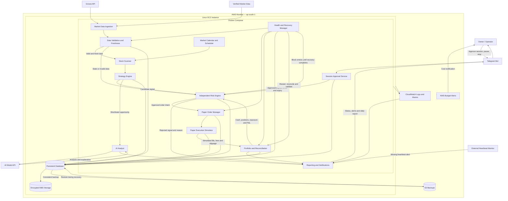
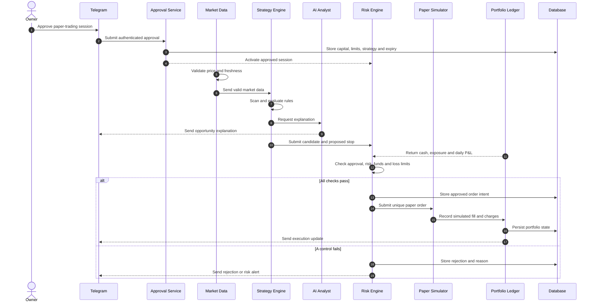
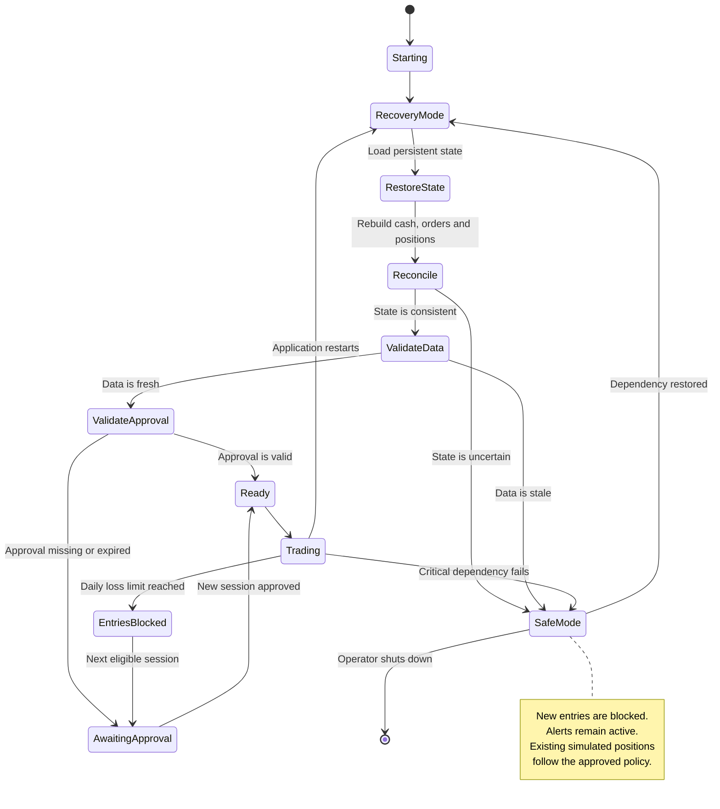

# Groww AI Trading Agent — High-Level Design

## System architecture

```mermaid
flowchart TB
    Operator["Owner / Operator"]
    Telegram["Telegram Bot"]
    Groww["Groww API"]
    MarketData["Verified Market Data"]
    AIProvider["AI Model API"]

    subgraph AWS["AWS Mumbai — ap-south-1"]
        subgraph EC2["Linux EC2 Instance"]
            subgraph Docker["Docker Compose"]
                Approval["Session Approval Service"]
                Ingestion["Market Data Ingestion"]
                Validator["Data Validation and Freshness"]
                Scanner["Stock Scanner"]
                Strategy["Strategy Engine"]
                AI["AI Analyst"]
                Risk["Independent Risk Engine"]
                OrderManager["Paper Order Manager"]
                Simulator["Paper Execution Simulator"]
                Portfolio["Portfolio and Reconciliation"]
                Reporting["Reporting and Notifications"]
                Scheduler["Market Calendar and Scheduler"]
                Health["Health and Recovery Manager"]
            end
            Database[("Persistent Database")]
            EBS[("Encrypted EBS Storage")]
        end
        S3[("S3 Backups")]
        CloudWatch["CloudWatch Logs and Alarms"]
        Budget["AWS Budget Alerts"]
    end

    ExternalMonitor["External Heartbeat Monitor"]

    Operator -->|"Approve session, pause, stop"| Telegram
    Telegram --> Approval
    Approval -->|"Approved capital, limits and expiry"| Risk
    Approval --> Database
    Reporting -->|"Status, alerts and daily report"| Telegram
    Telegram --> Operator

    Groww --> Ingestion
    MarketData --> Ingestion
    Ingestion --> Validator
    Validator -->|"Valid and fresh data"| Scanner
    Validator -->|"Stale or invalid data"| Risk
    Scheduler --> Scanner
    Scanner --> Strategy
    Strategy -->|"Candidate signal"| Risk
    Strategy -->|"Shortlisted opportunity"| AI
    AI --> AIProvider
    AIProvider -->|"Analysis and explanation"| AI
    AI --> Reporting

    Portfolio -->|"Cash, positions, exposure and P&L"| Risk
    Risk -->|"Approved order intent"| OrderManager
    Risk -->|"Rejected signal and reason"| Reporting
    OrderManager --> Simulator
    Simulator -->|"Simulated fills, fees and slippage"| Portfolio
    Portfolio --> Reporting

    Validator --> Database
    Strategy --> Database
    Risk --> Database
    OrderManager --> Database
    Simulator --> Database
    Portfolio --> Database
    Database --> EBS

    Health --> Validator
    Health --> OrderManager
    Health --> Portfolio
    Health --> Database
    Docker --> CloudWatch
    EC2 --> CloudWatch
    CloudWatch --> Reporting
    ExternalMonitor -->|"Missing heartbeat alert"| Reporting

    Database -->|"Consistent backup"| S3
    S3 -->|"Restore during recovery"| Database
    Health -->|"Restart, reconcile and validate"| Portfolio
    Health -->|"Block entries until recovery completes"| Risk

    AWS --> Budget
    Budget -->|"Cost notification"| Operator
```

## Trade flow

```mermaid
sequenceDiagram
    autonumber

    actor Owner
    participant Telegram
    participant Approval as Approval Service
    participant Data as Market Data
    participant Strategy as Strategy Engine
    participant AI as AI Analyst
    participant Risk as Risk Engine
    participant Simulator as Paper Simulator
    participant Portfolio as Portfolio Ledger
    participant Database

    Owner->>Telegram: Approve paper-trading session
    Telegram->>Approval: Submit authenticated approval
    Approval->>Database: Store capital, limits, strategy and expiry
    Approval-->>Risk: Activate approved session

    Data->>Data: Validate price and freshness
    Data->>Strategy: Send valid market data
    Strategy->>Strategy: Scan and evaluate rules
    Strategy->>AI: Request explanation
    AI-->>Telegram: Send opportunity explanation

    Strategy->>Risk: Submit candidate and proposed stop
    Portfolio-->>Risk: Return cash, exposure and daily P&L
    Risk->>Risk: Check approval, risk, funds and loss limits

    alt All checks pass
        Risk->>Database: Store approved order intent
        Risk->>Simulator: Submit unique paper order
        Simulator->>Portfolio: Record simulated fill and charges
        Portfolio->>Database: Persist portfolio state
        Portfolio-->>Telegram: Send execution update
    else A control fails
        Risk->>Database: Store rejection and reason
        Risk-->>Telegram: Send rejection or risk alert
    end
```

## Recovery flow

```mermaid
stateDiagram-v2
    [*] --> Starting
    Starting --> RecoveryMode

    RecoveryMode --> RestoreState: Load persistent state
    RestoreState --> Reconcile: Rebuild cash, orders and positions
    Reconcile --> ValidateData: State is consistent
    Reconcile --> SafeMode: State is uncertain

    ValidateData --> ValidateApproval: Data is fresh
    ValidateData --> SafeMode: Data is stale

    ValidateApproval --> Ready: Approval is valid
    ValidateApproval --> AwaitingApproval: Approval missing or expired

    Ready --> Trading
    AwaitingApproval --> Ready: New session approved

    Trading --> EntriesBlocked: Daily loss limit reached
    Trading --> SafeMode: Critical dependency fails
    Trading --> RecoveryMode: Application restarts

    EntriesBlocked --> AwaitingApproval: Next eligible session
    SafeMode --> RecoveryMode: Dependency restored
    SafeMode --> [*]: Operator shuts down

    note right of SafeMode
        New entries are blocked.
        Alerts remain active.
        Existing simulated positions
        follow the approved policy.
    end note
```
